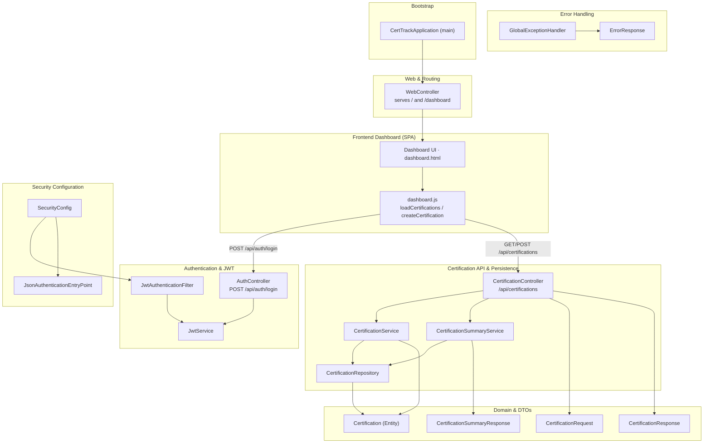

# CertTrack

A certification and skill tracker built as a **single self-contained Spring Boot application** — no Docker, no external services required. It ships an embedded web server, an in-memory database (dev), JWT authentication, a REST API, and a single-page Thymeleaf dashboard.

- **Runtime:** Java 21+, Spring Boot 3.3.5
- **Database:** H2 in-memory (dev, zero setup) · PostgreSQL (prod)
- **Auth:** JWT bearer tokens
- **UI:** server-rendered dashboard + vanilla JS SPA (`/`)
- **API docs:** Swagger UI at `/swagger-ui.html`

---

## Run it (one app, no Docker)

From the project root — the Maven wrapper handles everything, no system Maven needed:

```bash
# Dev mode (in-memory H2, auto-restart friendly)
./mvnw spring-boot:run

# …or build a jar and run it
./mvnw clean package
java -jar target/certtrack-0.0.1-SNAPSHOT.jar
```

Then open:

| URL | What |
|-----|------|
| http://localhost:8080 | Dashboard |
| http://localhost:8080/swagger-ui.html | API docs |
| http://localhost:8080/h2-console | H2 console (dev) |

Default login: `admin` / `password`. Data lives in memory and resets on restart (dev profile).

### Production profile (PostgreSQL)

```bash
SPRING_PROFILES_ACTIVE=prod \
DATABASE_URL=jdbc:postgresql://<host>:5432/certtrack \
DATABASE_USERNAME=certtrack DATABASE_PASSWORD=<secret> \
CERTTRACK_JWT_SECRET=<32+ char secret> CERTTRACK_PASSWORD=<admin pw> \
java -jar target/certtrack-0.0.1-SNAPSHOT.jar
```

---

## Architecture graph

The diagram below is generated from a [graphify](https://github.com/safishamsi/graphify) knowledge graph of this codebase
(**194 nodes · 413 edges · 13 communities**). Each box is a module; arrows are real
call/reference relationships extracted from the source. The interactive version lives at
[`graphify-out/graph.html`](graphify-out/graph.html).



### Core abstractions (most-connected "god nodes")

| Rank | Node | Edges | Role |
|------|------|-------|------|
| 1 | `Certification` | 24 | Central JPA entity |
| 2 | `CertificationService` | 16 | Business logic |
| 3 | `JwtService` | 14 | Token issue/verify |
| 4 | `CertificationController` | 13 | REST endpoints |
| 5 | `CertificationResponse` | 11 | API DTO |
| 6 | `GlobalExceptionHandler` | 10 | Error mapping |
| 7 | `SecurityConfig` | 10 | Filter chain wiring |
| 8 | `AuthController` | 9 | Login endpoint |

### Modules (graph communities)

`Certification API & Persistence` · `Authentication & JWT` · `Certification Domain Entity` ·
`Error Handling` · `Security Configuration` · `Frontend Dashboard (SPA)` ·
`JSON Auth Entry Point` · `Summary & Web Routing` · `Integration Tests` ·
`Application Bootstrap` · `Maven Wrapper Script`

> Regenerate the graph any time with `/graphify` — outputs land in `graphify-out/`
> (`graph.html`, `GRAPH_REPORT.md`, `graph.json`).

---

## Request flow

1. Browser loads `/` → `WebController` renders `dashboard.html`.
2. User logs in → `dashboard.js` POSTs to `/api/auth/login` → `AuthController` authenticates and `JwtService` returns a bearer token (stored in `localStorage`).
3. Dashboard calls `/api/certifications` and `/api/certifications/summary` with the token.
4. `JwtAuthenticationFilter` validates the token; `CertificationController` → `CertificationService` → `CertificationRepository` → H2/PostgreSQL.
5. Errors are normalized by `GlobalExceptionHandler` into `ErrorResponse` JSON.

## Project layout

```
src/main/java/com/certtrack
├── CertTrackApplication.java      # entry point
├── auth/                          # AuthController, JwtService, JwtAuthenticationFilter
├── certification/                 # Controller, Service, Repository, Entity, DTOs
├── common/                        # exceptions + GlobalExceptionHandler
└── config/                        # SecurityConfig, WebController
src/main/resources
├── templates/dashboard.html       # SPA shell
├── static/js/dashboard.js         # frontend logic
└── application.properties         # dev (H2) + prod (PostgreSQL) profiles
```
